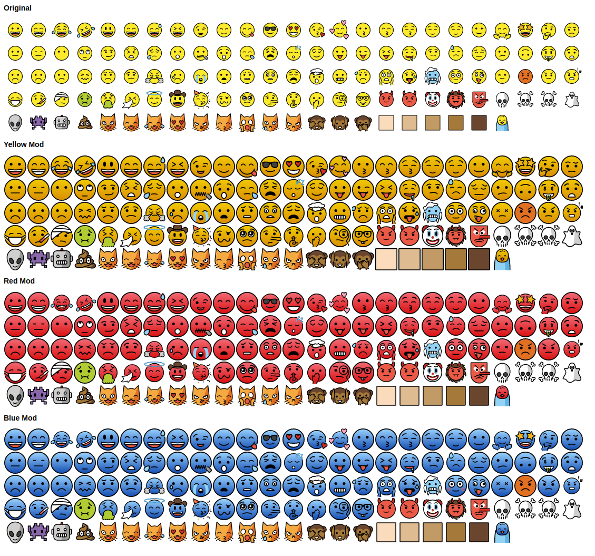

# openmoji-mod

Quick and easy customization of [OpenMoji](https://openmoji.org/) emoji pack. 
Script will by default remove excessive padding around original emojis and replace yellow color with custom one.

## Usage
PHP CLI and imagick extension is required (`apt install php-cli php-imagick`).
Place OpenMoji original images to svg directory. Then simply run:
```
php improve-openmoji.php 
```
or specify gradient color 
```
php improve-openmoji.php "#ffffff" "#dddddd"
```

## Sample output


## License
¹ OpenMoji graphics are licensed under the Creative Commons Share Alike License 4.0 ([CC BY-SA 4.0](https://creativecommons.org/licenses/by-sa/4.0/))

[](https://creativecommons.org/licenses/by-sa/4.0/)

² Code licensed under the GNU Lesser General Public License v3 ([LGPL-3.0](https://www.gnu.org/licenses/lgpl-3.0.en.html))

[](https://www.gnu.org/licenses/lgpl-3.0.en.html)
